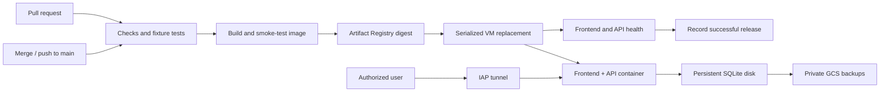

## Context

See [proposal.md](proposal.md) for motivation and the proposed hosting/access defaults. The user approved implementation and supplied project `project-783f506d-73dd-47d4-96d`. The default remains private IAP access in `asia-east1`; application/administrator identities and production model-secret versions still require operator configuration.

The checked-out application already builds React/Vite assets into `apps/web/dist`, which `apps/server/src/app.js` serves alongside the API. `main.js` binds to loopback. Configuration reads `.env` with process-environment precedence. Storage uses synchronous `better-sqlite3`, WAL, schema version 4 after integrating the plot editor, live drill stage and voice evidence from main, and a global single-active-session constraint. The engine schedules asynchronous model work after returning HTTP 202 and keeps cancellation/job state in memory. Startup calls recovery for every unfinished session. These observations favor an always-running single application instance.

The frontend currently calls its workspace and records local. That wording becomes incorrect for GCP. There are no workflow, container, or infrastructure files. Main has consolidated its text, plot, stage and voice requirements under `openspec/specs/`. Local-only requirements remain the baseline for local mode; this change adds cloud-mode requirements and a `local-runtime` disclosure delta. Archived changes remain historical evidence and are not rewritten.

## Goals / Non-Goals

**Goals:** Keep the deployed application close to the current runtime, make every release and recovery identifiable, separate application replacement from persistent data ownership, and make the first deployment reproducible.

**Non-Goals:** A managed PostgreSQL rewrite, distributed background jobs, per-user authorization inside the app, automatic data rollback, public ingress, or transparent continuation of exercises across restarts. These boundaries preserve the behavior of the existing engine rather than implying a scalable multi-user service.

## Decisions

### 1. One container on Compute Engine

Use one non-Spot Compute Engine VM running Container-Optimized OS and a systemd-managed Docker container. Terraform supplies cloud-init/startup configuration. Avoid the deprecated `create-with-container`, `update-container`, and `gce-container-declaration` path; Google recommends startup scripts or cloud-init for continuing to run containers on VMs. [GCP migration guidance](https://docs.cloud.google.com/compute/docs/containers/migrate-containers)

The image contains both the built frontend and production Node dependencies. A multistage Dockerfile installs from the lockfile, builds the web assets, and retains the native SQLite binary compiled or installed for the same Linux architecture and Node ABI as the final image. Pin the supported Node image and CI runtime consistently when implementing, and test the native binding inside the built image. Run the application as a non-root UID with write access only to the intended data area and temporary files. `.dockerignore` excludes `.env*` except examples, `.git`, local data, worktree helpers, dependencies, and test output.

A separate static frontend host would introduce configuration and release coordination without benefiting this application. Cloud Run remains an alternative if a future change externalizes storage and coordinates background work across instances: its ordinary container filesystem is not persistent, and the current process-local recovery model is unsafe during overlapping instances. Setting a maximum instance count alone does not solve those application constraints. [Cloud Run runtime contract](https://docs.cloud.google.com/run/docs/container-contract)

### 2. Private access through IAP

Create a dedicated VPC/subnet with no broad ingress rules. Permit TCP 8080 and SSH 22 only from the IAP TCP forwarding range to this VM. The initial VM has an external IPv4 address for outbound image, Google API, and model-provider access, but its ingress firewall permits only IAP. This avoids requiring a load balancer or Cloud NAT for the initial small deployment; IPv4 and VM usage still incur charges.

Application users receive a VM-scoped IAP tunnel grant conditioned on destination port 8080, plus only the resource-discovery permissions needed by the documented client command. Deployment administrators receive port-22 tunnel and OS Login administration separately. The browser command is `gcloud compute start-iap-tunnel` with a loopback local port; a custom domain and public HTTPS endpoint are not provisioned. IAP provides the authenticated encrypted transport, while the browser talks to a local forwarded HTTP origin. [IAP TCP forwarding](https://docs.cloud.google.com/iap/docs/using-tcp-forwarding)

Inside Docker, bind the backend to `0.0.0.0:8080`, publish the port on the VM, and retain rejection of non-loopback browser Origin headers. The browser's tunnel URL remains loopback. The firewall and IAP form the network access boundary; the Origin check is additional browser protection, not authentication. Main's persistent HttpOnly workspace cookie scopes history, plots, active exercises, and voice operations within the application. Separate browser workspaces can run independent exercises concurrently.

### 3. Cloud configuration and accurate UI

Extend server configuration with validated `HOST` and `DEPLOYMENT_MODE=local|gcp`, defaulting to local mode and loopback. GCP supplies `PORT=8080` and an absolute `DATABASE_PATH=/data/role-cast.sqlite`. The host launcher must verify the expected data disk is mounted before starting Docker; a mere existing `/data` directory is insufficient. Cloud startup additionally validates its path and settings. Keep environment-over-file precedence and current local commands intact. The existing `rolecast-llm-api-key` secret is mapped to current main's shared `API_KEY` for text and GPT Live, retaining the three existing secret resources. Voice uses main's default OpenAI endpoint and voice. The approved text endpoint is OpenAI and its key matches the existing shared key. The voice relay must accept same-host loopback HTTP origins through IAP even when the local forwarding port differs from container port 8080, while rejecting unrelated origins and forwarded-host spoofing.

Add a minimal `/api/runtime` response containing only the deployment mode. Use it to select the frontend workspace label and storage/sharing notice; do not expose provider configuration, secret references, or filesystem paths. Retain the external-inference disclosure in both modes. This is runtime metadata because the same image must run without baking production configuration into browser assets.

### 4. Infrastructure bootstrap and identities

Add parameterized Terraform under `infra/gcp/`, a non-secret example variable file, and a guide for initializing a private versioned GCS Terraform-state bucket before applying the main resources. Pin Terraform/provider versions and commit the provider lockfile. Infrastructure configuration covers:

- Required service APIs, Artifact Registry, VPC/subnet/firewall, OS Login, the VM, and its separately attached data disk.
- Disk `auto_delete=false`, resource deletion protections, a private backup bucket with public-access prevention, and a configurable 30-day object lifecycle.
- Secret Manager secret containers, but no secret values or secret-version payloads in Terraform state.
- A VM runtime service account with reader access to its image repository, accessor access to the named runtime secrets, and object-creation access to its backup bucket. Backup viewing/restoration access belongs to operators separately.
- A deployment service account with repository publishing, scoped VM discovery, IAP/OS Login deployment access, and any narrowly required service-account-use permission. It does not receive project Owner/Editor or routine infrastructure deletion rights. VM administrative access remains privileged and is restricted to trusted main-branch workflow code.
- GitHub Workload Identity Federation mapped to stable numeric repository/owner IDs. The provider condition also restricts `ref` and the designated workflow path on `main`; a GitHub production environment name alone is insufficient. [GCP deployment federation](https://docs.cloud.google.com/iam/docs/workload-identity-federation-with-deployment-pipelines)

An administrator performs bootstrap once using their own authenticated CLI session. Routine release jobs do not run Terraform or alter IAM. Operators add secret versions directly to Secret Manager and map their non-secret version resource names into runtime configuration. Fetch values with the VM identity into an owner-restricted temporary runtime env file; never echo values or use shell tracing. Refetch on boot and remove temporary files on stop. Pin secret versions so release metadata can identify the configuration used, without storing the values. [Secret Manager guidance](https://docs.cloud.google.com/secret-manager/docs/best-practices)

Terraform outputs document the GitHub production variables: project ID, region, zone, repository, instance, WIF provider, deployment service account, runtime secret-version references, and backup bucket. Resource names and authorized principals are explicit inputs. Bootstrap settings use the supplied project and default `asia-east1` / `asia-east1-b`; access identities remain explicit operator inputs.

### 5. GitHub Actions release path

Use `ci.yml` for pull-request validation and reusable validation of `main`; use `deploy-gcp.yml` for `push` on `main` and a guarded `workflow_dispatch` retry of current `main`. A main push naturally includes PR merges and also deploys direct main pushes; document branch protection if all production changes must go through PRs. Do not use a closed-PR event to deploy the feature branch or its unmerged head. [GitHub workflow events](https://docs.github.com/en/actions/reference/workflows-and-actions/events-that-trigger-workflows)

Required checks: locked installation, lint/format, build, unit/integration tests, Playwright with its installed browser, container build, native SQLite loading, and container frontend/API/storage smoke checks. Use fixtures and temporary databases with no production credentials. Pin third-party actions to full commit SHAs. Build once, test that image, push it, resolve its digest, and deploy that exact digest; do not rebuild a different artifact in the deployment job.

Only the production job receives `id-token: write`; repository access defaults to `contents: read`. Use the official Google auth action and short-lived credentials. Validate all configuration before connecting to the VM. Use a production concurrency group with `cancel-in-progress: false`, plus a host lock shared by release and recovery helpers. Recheck the candidate against current main immediately before replacement and compare its generation/ancestry with persisted successful release metadata to reject stale reruns. GitHub concurrency alone is not treated as a FIFO queue. [GitHub concurrency](https://docs.github.com/en/actions/how-tos/write-workflows/choose-when-workflows-run/control-workflow-concurrency)

The summary records commit, digest, instance, verification result, recovery result when relevant, and an application tunnel command. It does not publish a misleading public URL.

### 6. Release replacement and persistent disk ownership

Mount the disk using its configured device identity, verify the filesystem and mountpoint, and set data ownership for the container UID. The first bootstrap can initialize only the explicitly provisioned empty disk; routine boots and deployments never format disks. A missing or unexpected mount fails closed. Keep release metadata and compatible previous-image identity outside the application database.

The host deployment transaction acquires its lock, verifies the candidate and secret availability, and pulls the digest while the old release is still running. It then stops the old systemd application unit, verifies that no writer remains, creates and uploads a consistent pre-release backup, and starts the candidate on the same data disk. If backup fails after stopping, restart the previous unit. On a first release with no database, record that there is no preexisting data to back up.

Probe both `/` and `/api/health`, including expected content and status. Commit successful release metadata atomically only after both pass. Keep transaction state sufficient for a lost SSH connection or VM reboot to resume recovery deterministically; do not leave a half-written image pointer as the boot configuration. The supervisor must not automatically respawn the old application while a replacement owns the lock.

If the candidate fails, stop it and check whether the previous image supports the current SQLite `user_version` without invoking application recovery or migrations. Restart the previous image only when compatible. A newer schema, missing previous image, or failed rollback leaves the service failed with the data retained and a clear operator result. A healthy rollback still makes the candidate workflow fail. This change adds no schema migration. Main now uses schema 4; the helper imports the storage schema constant and permits rollback only to an image matching the current schema. Never automatically copy a backup over current data.

### 7. Backups and explicit restoration

Provide a JavaScript backup helper using SQLite's online backup API directly, without constructing the engine or running startup recovery. It captures committed WAL state without interrupting exercises. Run an integrity check on the copy, record its schema version/commit/digest/time/checksum, and upload a unique private object and manifest. A daily systemd timer calls the helper and uploader; a deployment's stopped-writer backup uses the same validation path under the host operation lock. [SQLite backup API](https://sqlite.org/backup.html)

Limit runtime backup IAM to creating unique objects; bucket lifecycle handles expiry. Record success/failure and last successful backup time in operator-visible status and logs without exercise payloads. The default recovery-point target is the most recent successful daily backup, up to 24 hours old under normal operation; it is not a zero-data-loss guarantee.

Restoration is a separate operator command with an explicit backup identity and destination. Download and validate into staging before stopping writers; verify a compatible image; stop the application; preserve the current database and its WAL/SHM companions together; install the restored copy with correct ownership; and run startup/health checks. Validate the restore on an isolated volume before allowing an explicit production restore. Do not run model requests during restore verification.

## Risks / Trade-offs

- A single VM and disk have a zone-level availability boundary, and releases briefly interrupt service → retain off-VM backups, document replacement and restoration, and clearly mark interrupted exercises.
- Workspace access follows the browser cookie rather than an account identity → disclose browser-scoped isolation; public accounts and cross-browser identity recovery require a separate product change.
- IAP tunnel access requires a Google identity and the GCP CLI → provide copyable access instructions; a conventional public domain with browser login is a different design.
- VM, disk, IPv4, backups, and model calls incur costs even at low traffic → document the resource inventory and configurable sizes/retention before bootstrap, without claiming a free tier covers the deployment.
- A deployment has elevated VM access → restrict OIDC claims, protect main/workflow changes, and keep production identity out of PR jobs.
- Stale or missing backups undermine recovery → fail releases when required backups fail, expose backup age, and require a restore drill in deployment validation.
- The other worktree is concurrently implementing GPT Live → work only on `gcp-ci-deploy`; resolve eventual main-branch integration before merge and rerun checks without importing uncommitted files.

## Migration Plan

Main integration note (2026-09-12): the initial schema-4/global-workspace observations above describe the original deployment baseline. Current main uses schema 5 with browser workspace ownership and voice-only participant controls. Deployment and rollback helpers continue to read the storage schema constant; preserve the workspace migration, private-history disclosure, and per-workspace active limit. This reconciliation updates artifacts only and does not represent another live GCP deployment or rerun of the original cloud acceptance.

1. Implement and validate this change in the isolated worktree. Preserve local env, data, and development behavior; keep all cloud tests clearly separated from offline checks.
2. Supply a billed project, region/zone, authorized principals, and resource settings. Review the infrastructure plan and bootstrap it. Add Secret Manager versions and GitHub production variables; do not copy the developer database or `.env` automatically.
3. Merge the reviewed branch into main. The merge commit runs checks, builds the image, and performs the first deployment automatically once prerequisites exist. If infrastructure was not yet ready, complete setup and dispatch the current-main retry.
4. Verify private access and denial, run a fixture-only deployment/rollback exercise on isolated data, reboot with retained records, and restore a backup to an isolated volume. Record evidence and any unavailable live validation honestly.
5. Future main merges repeat the release process. Roll back compatible images through the documented operation; restoring older data remains an explicit operator decision.

## Open Questions

The supplied project is active with billing enabled. Defaults are `asia-east1` / `asia-east1-b`, resource name `rolecast`, and 30-day backup retention. Trusted principal emails and production secret versions remain required bootstrap inputs; region, sizes and retention remain configurable. No real secret values belong in these artifacts.
