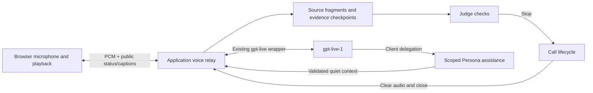

## Context

See [proposal.md](proposal.md) for the requested experience and the two capability specs for its contract.

Observed implementation constraints:

- `apps/web/src/main.jsx` owns the composer, `sessionStorage` text retry IDs, and 500 ms REST polling. Call acceptance immediately invokes the text Persona opening. There is no audio controller.
- `Engine.send` accepts one complete user message, launches Persona and Judge concurrently, and publishes the Persona result only after Judge allows it. `Engine.launch` invalidates earlier jobs using session versions; using it for every voice fragment would continually cancel Judge work.
- `roleContext("reply", ...)` already selects the Persona's assigned facts, shared messages, and own history. Its current prompt requires JSON, so it cannot be reused as the spoken conversation prompt.
- `Store` has schema version 1, append-only message inserts, and JSON payloads. Existing evidence validation and report anchors reference message IDs. Restart marks active exercises interrupted.
- `@role-cast/gpt-live` already supports a primary WebSocket, PCM16LE 24 kHz, early event subscription, client delegation, finite waits, safe errors, and confirmed/incomplete finalization. Its existing tests exercise the pinned SDK. This change consumes that package.
- The implemented specs are in completed, unarchived changes; the main spec tree is empty. These are new voice-specific contracts. Generic identity, single-call closure, secrecy, and reporting constraints still apply. The gated, complete-text-turn behavior remains specific to text mode.

Official references inspected for this integration: [Live overview](https://developers.openai.com/api/docs/guides/live), [session events](https://developers.openai.com/api/docs/guides/live-conversations), [WebRTC setup](https://developers.openai.com/api/docs/guides/voice-webrtc?api=live), [server controls](https://developers.openai.com/api/docs/guides/voice-server-controls?api=live), and [delegation](https://developers.openai.com/api/docs/guides/live-delegation). The pinned SDK's `ClientConfig`/`DataChannelConfig` types also show that browser event permissions default to allowing all events. A sideband alone does not hide session configuration from the browser.

## Goals / Non-Goals

**Goals:** Separate audio transport, durable evidence, Judge scheduling, and call lifecycle; reuse current role/evidence boundaries; support voice-first and text-to-voice entry; make browser cleanup and offline tests deterministic.

**Non-Goals:** No browser speech-recognition substitution, chained text-response-plus-TTS pipeline, semantic turn-end invention, raw audio persistence, or automatic paid-session resumption. Voice is a continuous conversation, not automated clicking of the current text form. The backend remains responsible for structured planning, evaluation, and assistance.

## Decisions

### 1. Use a server-owned primary Live WebSocket

The relay consumes `connectWebSocket` with an early `onEvent` handler. It maps provider output to a small public protocol instead of forwarding provider JSON. There is one provider connection and one browser owner per voice attempt. Extend the Vite `/api` proxy with WebSocket support and use `ws` attached to the existing HTTP server; declare that dependency explicitly in the server workspace.

WebRTC is a reasonable lower-hop alternative, and the wrapper supports it. However, the current wrapper does not expose frontend event permissions, and startup/session events can contain private instructions. Implementing event filtering, private readiness signaling, and a second server connection is avoidable for this version. The relay gives this application a single transcript/control owner and a clear privacy boundary. Its extra network hop and browser resampling cost must be measured in the voice smoke test.

### 2. Application protocol and ownership

| Entry point | Behavior |
| --- | --- |
| `GET /api/capabilities` | Public configured voice availability, fixed model, safe unavailable reason; no account-access claim |
| `POST /api/sessions/:id/calls/accept` | Add optional `mode: "text" | "voice"`, default text; voice skips the text opening |
| `POST /api/sessions/:id/calls/:callId/voice` | Atomically reserve one attempt for an idle active call; return `voiceId` and an in-memory, single-use attachment token |
| `WS /api/sessions/:id/calls/:callId/voice/:voiceId` | First JSON frame binds the token; then binary PCM plus a narrow control protocol |
| Existing hangup/finish routes | Use the shared lifecycle to terminate voice as well as text |

Validate the exact serving origin for production and the configured localhost frontend origin in development, the current exercise/call, and ownership. Tokens expire after 30 seconds, are sent in the first frame rather than URLs, and are never logged or persisted. A missing attach within that interval releases the reservation without creating a provider session. A repeated reservation ID can return its existing pending result; another owner conflicts. After a token is consumed, reconnect requires cleanup and a fresh explicit attempt, not replay of the old request.

Browser controls are limited to attach, mute/unmute, return-to-text, and liveness. Binary input is mono PCM16LE at 24 kHz. Server controls expose ready, safe status/error, public caption/checkpoint updates, microphone acknowledgment, and stopped. Output binary frames contain decoded PCM. Every JSON update includes the application attempt ID and a monotonic sequence. No generic Live `sendEvent`, client-supplied transcript, provider model/base URL, raw session configuration, or tool-result forwarding is exposed.

Use application-level heartbeat acknowledgment every 5 seconds and a 15-second ownership timeout. This is separate from TCP connection state: a stalled tab or lost network must not leave a paid session running indefinitely. Detect a lost browser socket immediately when possible. Client control/heartbeat loss clears playback and capture locally; server owner loss finalizes the provider attempt. No automatic reconnect.

### 3. Browser audio controller

Create a small controller outside React with injectable media/transport dependencies and explicit start/mute/stop/dispose methods. A hook binds it to the current call and owns cleanup on unmount, navigation, mode change, and terminal state.

From the microphone button gesture, create/resume an `AudioContext`, request `getUserMedia({ audio: { echoCancellation: true, noiseSuppression: true, autoGainControl: true } })`, and initialize the worklets before reserving voice. Record the actual context sample rate. Use streaming, stateful resampling to 24 kHz and encode complete PCM16LE samples into 40 ms packets. Support at least actual 24, 44.1, and 48 kHz contexts; do not assume the requested rate was honored. The microphone is not monitored to the user's speakers.

The output worklet plays decoded 24 kHz PCM through a bounded ring buffer resampled to the actual context rate. Keep microphone input running while output plays so Live can respond to interruptions. Do not gate input with browser silence detection or wait for transcript events. Keep normal local playback backlog at or below 250 ms, and bound each transport queue to 500 ms worth of encoded PCM. Overflow is an explicit failed attempt; terminate and offer text rather than silently losing/replaying speech. Expected queue clearing on stop is intentional and recorded separately from overflow.

During mute, disable the microphone track locally and send the server mute command. Continue real-time silence packets as needed for primary Live frame progression, without participant samples. Distinguish local mute from provider acknowledgment. Restore samples only on an explicit unmute. If audio output is suspended by the browser, show「啟用聲音」and require a gesture before claiming audible conversation.

Stop closes the worklet/ports, cancels scheduling, clears queued playback immediately, stops every acquired media track, closes the audio context and socket, and ignores messages carrying an old attempt ID. Partial setup failures use the same cleanup. No media acquisition occurs on page load or from a retry timer.

### 4. Call modes and startup ordering

Add call input mode and an independently versioned voice attempt: `starting → active → stopping → closed | failed | interrupted`. Preserve the existing exercise states. `session.busy` remains the text-agent indicator; voice connection/playback/Judge states are separate.

For an existing text call, activation is allowed only after current text work settles. Reserve mode before opening Live so competing text requests are rejected. Build voice context from `roleContext("reply", ...)`, including the assigned identity and facts; use a dedicated natural-speech instruction rather than the JSON prompt. Seed supported text history without duplicating checkpoints/fragments. Coalesce adjacent same-speaker checkpoints and cap initial message count at the wrapper's 128-item limit; scoped backend assistance can access the full authorized saved history when the live context window needs more detail. Never include another Persona's private history or Judge's private notes.

For voice acceptance, acquire browser permission before accepting the pending assignment. Create the call once with `mode: "voice"` and no text opening. After Live `session.started`, begin real-time audio/silence input and request one immediate Traditional Chinese greeting with `appendInstructions(..., { delegationId: null })`. Mark the greeting request once per call, handle its acknowledgment, and do not retry it automatically. A mode switch into an already opened call carries its history and asks to continue without replaying a greeting.

Returning to text stops accepting voice input and freezes the attempt, seals accepted transcript text, then closes the provider with the wrapper's finite deadline. It does not create a call Recap. Before enabling typed input, resolve or boundedly settle the final required Judge checkpoint; a resulting Judge stop wins over returning to text. If a voice-first setup fails before any Persona opening exists, text fallback requests one text opening. Provider/media failures are scoped to the voice attempt when the core evaluation state is still healthy; Judge/storage failures follow the existing exercise failure policy.

### 5. Source fragments, captions, and immutable evidence

Add SQLite schema version 2 with `voice_attempts` and `voice_fragments`, keyed to application call IDs. Attempt metadata records local lifecycle, provider session ID, start/end times, close reason, usage finalization status, and uncertainty. Fragment records include an application ID, attempt ID, nullable provider event ID, speaker, exact delta, start/end milliseconds, and monotonically assigned receive sequence. Enforce unique provider event IDs per attempt when supplied. For absent IDs, preserve each received event as a distinct source record rather than deduplicating by text.

Persist each accepted fragment before publishing its public caption. Discard reflected input/output audio after transport; it is not a database collection. Store neither secrets nor full provider session/error events.

Every 1 second, checkpoint previously uncheckpointed source fragments separately per speaker into existing immutable `messages` records. Split only as needed to respect message-size limits. A checkpoint stores `source: "voice"`, its fragment IDs, attempt ID, timing range, and `partial: true`: it is an evidence slice, never a semantic turn. Allocate normal message IDs/sequences so Judge/reference validation and report links stay usable. Seal remaining accepted fragments on mode/call stop. Whitespace-only fragments remain source data and attach to the next nonempty checkpoint where possible; they do not independently trigger Judge.

Checkpoint text concatenates source deltas in their received order. Late timestamps are retained and flagged; later evidence is appended instead of changing previously evaluated text. Display groups can be revised using source timing and speaker, but report anchors always show the exact immutable checkpoint. A caption group is not an extra Persona reply. Avoid showing both a live caption and its corresponding checkpoint as duplicate speech. Preserve existing text message display for text-only calls.

Generated Persona captions have `playback: "unconfirmed"`; connection loss/stop while audio is queued additionally marks the affected attempt interrupted. Playback counters can indicate active/cleared audio but cannot prove word-level delivery because the primary output frames lack authoritative text/audio alignment. Reports must not assume all generated questions were heard. The start screen/voice help explains recognition and playback uncertainty.

### 6. Judge scheduling, assistance, and limits

Add a voice-specific Judge scheduler keyed by `(exerciseId, callId, voiceId, generation)`. It allows one check in flight and one pending high-water mark. New user checkpoints advance that mark; when the check settles, another check covers all additional accepted user evidence. Do not run `Engine.launch` per fragment or cancel a useful check on every new word. Call/attempt shutdown invalidates the appropriate generation, and all results re-check current ownership before mutation.

Use the existing validated `watch` result with a voice-aware prompt that identifies checkpoint text as potentially partial, includes scoped current-call evidence, and requires valid criteria/evidence for a stop. A failure after the existing finite agent policy ends the exercise explicitly. Checkpoint rate controls backend work; voice playback never awaits that work. New caption boundaries do not schedule external tools, approve actions, or count as completed answers.

Handle client delegation with one bounded, deduplicated Persona-assistance job per attempt and a small pending limit. Add a `voiceAssist` contract containing a bounded `context` string and `requestHangup` boolean. Its prompt uses authorized Persona context and accumulated transcript, asks for necessary factual guidance or a justified hangup decision, and does not produce a second user-facing reply. Return valid context through `appendThinking` with the delegation ID; do not expose backend JSON or use commentary to replay an answer already spoken. A current validated hangup uses `reason: "persona"`. No Mastermind planning or external tool execution occurs here. Judge is scheduled independently of whether Live delegates.

Continuous voice has no documented authoritative turn counter. Keep typed-turn counting for `source !== "voice"` messages and retain the scenario's total-call limit. Add `maxVoiceSecondsPerCall`, default 180, to the scenario snapshot/public limit description. Count cumulative wall-clock provider-active voice duration across attempts, including muted periods; reserve/pending attempts also have their startup deadlines. On expiry, close the call with `voice_duration_limit` and produce Recap. This avoids treating dozens of caption fragments as 12 completed replies or allowing mode switches to reset the budget.

### 7. One stop path and a fixed Recap boundary

Manual hangup, finish, Judge stop, Persona hangup, and duration expiry use an idempotent core stop transition. Introduce a core lifecycle notification or injected media hook so every path invalidates the voice generation, freezes accepted source text into checkpoints, stops browser output immediately through the relay, and begins bounded provider close. Recap reads the fixed evidence snapshot only after sealing, never a mutable live fragment buffer.

Once the application stop cutoff is committed, ignore later provider transcript/audio for evidence/publication; accept `session.closed` only to finalize usage metadata. Text recognized after that cutoff is not fabricated as accepted speech. Incomplete attempts retain an uncertainty marker. The old wrapper's `close()` result distinguishes final usage from the latest unconfirmed usage; failed finalization does not silently claim success or reopen the session.

Mode changes seal evidence but keep the call active. Owner loss follows bounded attempt cleanup and returns to text when healthy; full server restart retains the existing `Store.recover()` behavior of interrupting the exercise. Extend recovery to mark voice attempts interrupted and checkpoint already persisted source fragments without starting model jobs. Await coordinator shutdown before closing SQLite.

### 8. Configuration, tests, and delivery

Use the existing server environment loader to read the shared `API_KEY`, optional `OPENAI_BASE_URL` (default official API root), and optional `LIVE_VOICE` (default `marin`), then pass explicit configuration to the wrapper. Text agents also use `API_KEY`; legacy `LLM_API_KEY` remains a text-only fallback if the shared key is absent or blank. `API_KEY` takes precedence when both are present, and process environment values override `.env` values for the same variable. Do not consume `OPENAI_API_KEY` or fall back to it for voice. Invalid optional voice configuration disables voice with a safe reason while valid text configuration still starts. Session model is always `gpt-live-1`, delegation is client, and `store` is false. `LLM_BASE_URL` and `LLM_MODEL` still configure planning/Judge/assistance/reporting. Document that configuration availability does not verify Live account access.

Use Vitest for resampling with synthetic PCM, exact fragment/checkpoint handling, migration/recovery, fake clocks, ownership races, privacy sentinels, and independent voice Judge jobs. Use a loopback application relay plus injected Live client to verify the actual WebSocket upgrade/packet boundary and Vite proxy. Browser tests inject controlled media/AudioContext/provider events, assert automatic audio/caption flow without clicking submit, and verify tracks/queues close after stop, reload, failure, and mode changes. Keep all existing text tests. A manual browser/audio checklist covers real microphone capture, natural interruption, Traditional Chinese speech, echo, latency, and real-account model access; do not claim those from mocks.

## Risks / Trade-offs

- Continuous output can precede Judge's stop → explicitly select concurrent voice evaluation; clear all application output when stop arrives and never claim earlier speech was withheld.
- Additional relay hop and browser resampling can affect latency/quality → small PCM packets, stateful conversion, bounded queues, deterministic audio tests, and real-device validation.
- Fragment checkpoints are partial and text can arrive late → source provenance, immutable checkpoint IDs, accumulated checks, visible uncertainty, and no silence/turn inference from event gaps.
- Provider disconnect can leave usage or latest speech uncertain → bounded close, incomplete status, fixed evidence cutoff, and no implicit retry.
- Switching media ownership can race with text jobs or another tab → atomic reservations, attempt generations, explicit conflicts, and one stop transition.
- Existing model contexts can grow with checkpoint counts → coalesce context views while retaining source/evidence IDs, cap Live history entries, and keep full authorized history available to the scoped backend.

## Migration Plan

1. Add optional config/capability reporting, media modules, tests, and the transactional version-1-to-2 SQLite migration. Existing data and text-mode defaults remain valid.
2. Wire the voice coordinator into server/core lifecycle, then add the browser controls and proxy. Enable voice only when configured and after a user gesture.
3. Run build, the full test suite, formatting/lint, and strict OpenSpec validation; record results separately from the real-account checklist.
4. Existing text-only installations may continue using `LLM_API_KEY` without `API_KEY`; adding the shared key makes voice available on explicit activation. Preserve version-2 records; an older version-1 binary intentionally rejects a newer schema. A binary rollback requires restoring a pre-migration database copy, not silently discarding voice evidence.

## Integration with main: plots and live stage

The 2026-09-12 rebase preserves main's plot editor, immutable drill snapshots, Reporter isolation, structured agent output contracts, and SSE stage feed. Voice uses the canonical `/api/drills` routes while retaining `/api/sessions` compatibility. Voice origins accept the existing exact local origins and same-host HTTPS tunnels; forwarded host headers do not grant access.

The branches independently used SQLite version 2. Voice version 2 contains voice tables and scenario snapshots; main version 2 contains plots, and version 3 adds stage metadata/events. The combined version 4 migration detects the plot table, converts legacy scenario snapshots, retains existing stage events and voice tables, and performs all migration steps in one transaction. Recovery seals committed pending voice fragments and records interruption once without restarting model work.

`maxVoiceSecondsPerCall` belongs to the editable plot definition and drill snapshot, defaults to 180, and accepts whole seconds from 1 through 3600. Caption checkpoints update public revisions without generating semantic stage turn events. Caption following observes the transcript panel's own scroll position. Voice assistance uses the same fixed structured output envelope as other operations, with empty context allowed and the existing 2000-character local bound.
